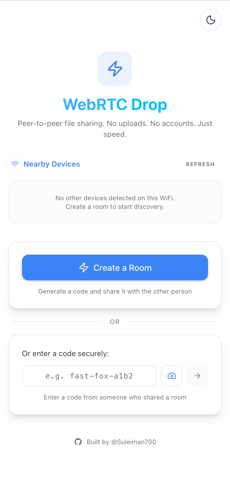

# WebRTC Drop — Showcase

**WebRTC Drop** is an ultra-secure, peer-to-peer file sharing and chat application that feels like a native experience in your browser. Files are sent directly between devices using WebRTC Data Channels — they **never touch a cloud server**.

> 📌 This is a **showcase repository**. It contains screenshots and a feature overview only. The full source code is maintained in a private repository.

  

---

## 📸 Screenshots

  

---

## ✨ Features

### Core File Transfer
- **Peer-to-Peer Encryption** — true end-to-end encryption via WebRTC DTLS, with an emoji + fingerprint verification code to manually confirm connection security.
- **Ultra-Fast Transfers** — files flow over WebRTC Data Channels rather than a central server; speed is dictated only by your network.
- **No File Size Limits** — send multi-gigabyte files directly device-to-device.
- **Multiple Files & Folders** — drag & drop many files or entire folders, automatically zipped with progress tracking.

### Transfer Control & Monitoring
- **Speed & ETA Dashboard** — real-time throughput graph, average speed, elapsed time, and ETA.
- **Pause / Resume / Cancel** — pause mid-transfer and resume without losing progress, or cancel from either side.
- **Transfer History** — review completed transfers with one-click re-download.
- **Large File Warning** — confirmation for files over 500 MB, with a one-click option to compress before sending.
- **Transfer Approval** — the receiver must approve incoming files before a transfer begins.

### Connection & Discovery
- **Nearby Device Discovery** — auto-detect devices on the same Wi-Fi/subnet without typing codes.
- **QR Code & Room Code Sharing** — generate a QR to scan, or copy a room code / invite link.
- **URL Joining** — share `?room=...` links; guests join automatically.
- **Reconnection Grace Period** — brief grace window for mobile guests who temporarily disconnect.

### Communication
- **Secure Text Chat** — floating chat multiplexed over the same data channel.
- **Clipboard Sharing** — send clipboard content directly through chat.
- **Visual & Audio Feedback** — notification sounds, vibration, and browser notifications.

### Delight & Feedback
- **Toss Animation** — a file puck flies across the screen toward your peer's avatar when you send.
- **Transfer Soundscape** — an optional generative tone whose pitch rises with live throughput — *hear* your transfer speed.
- **Completion Confetti & Receipt** — a confetti burst plus a shareable receipt card (size, average speed, time).
- **Peer Avatar** — a deterministic emoji avatar for each connected peer.

### Security & Privacy
- **End-to-End Verification** — DTLS fingerprint verification with emoji security codes to prevent MITM attacks.
- **Rate Limiting** — server-side protection against room creation/joining spam.
- **Room TTL** — rooms auto-expire after inactivity.
- **Hardened Headers** — Content Security Policy and other security headers.

### UI / UX
- **PWA Ready** — install on iOS/Android home screens or desktop.
- **Screen Wake Lock** — keep the screen awake during long transfers.
- **Dark / Light Mode** — automatic theme switching based on system preference.
- **Mobile Responsive** — optimized for both mobile and desktop.
- **Connection Quality Badge** — live ICE type (host/srflx/relay), protocol, and RTT.

---

## 🛠️ Tech Stack

- **Client** — React 19, TypeScript, Vite
- **Styling** — Tailwind CSS v4, Lucide React icons, custom dark/light theme
- **Connectivity** — WebRTC (`RTCDataChannel`, `RTCPeerConnection`)
- **Signal Server** — Node.js, Express, Socket.io *(used only for the initial WebRTC handshake — all data transfers happen peer-to-peer)*
- **Relay** — self-hostable CoTURN for CGNAT / strict-network traversal

---

## 📄 License

Released under the [MIT License](https://opensource.org/licenses/MIT).
